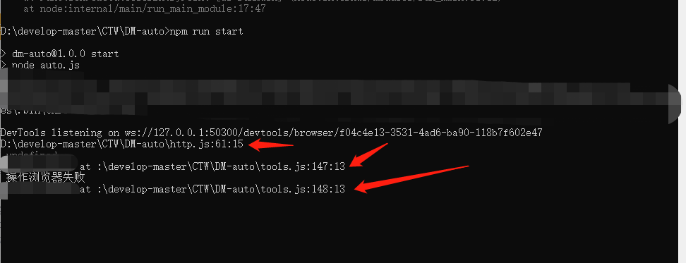

> 这个是为了在node打印的时候主动显示打印的具体行数和打印的源文件



## 安装

```bash
npm install node-console-details -S

or

yarn add node-console-details
```

## 使用

```js
var consoleFun = require('node-console-details');
//直接调用就好了
consoleFun()
console.log(consoleFun)
```
## git地址：https://github.com/chentiewei/node-console-details
